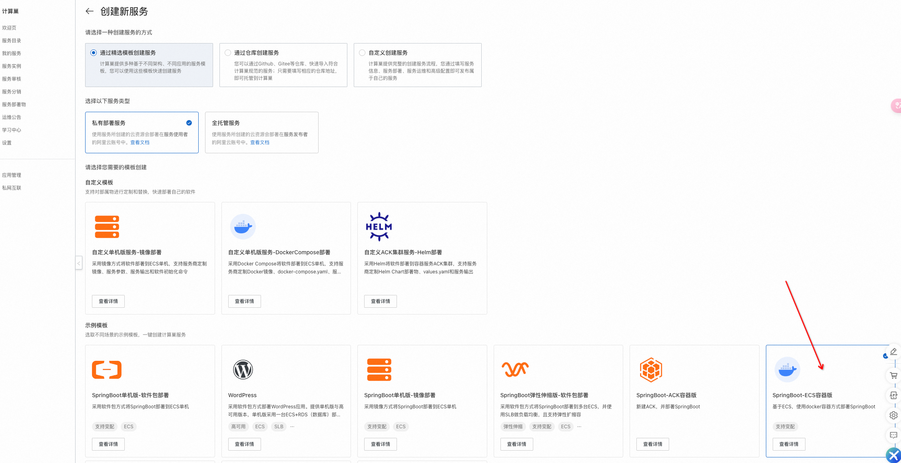
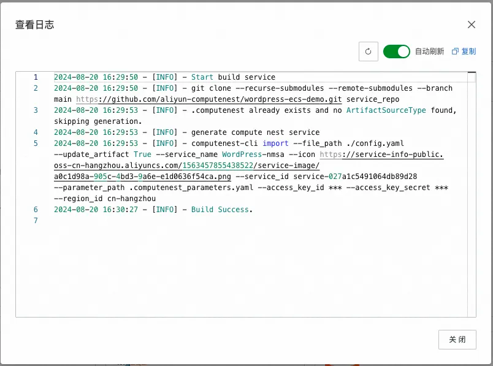

# SpringBoot ECS Docker Demo

## 简要介绍
本仓库包含构建一个计算巢服务的所有配置和资源，通过该仓库Demo，开发者可以快速构建服务，并借此对计算巢服务有初步的认识。
当构建出计算巢服务后，开发者可以进一步地根据自身情况进行修改，直到构建出一个符合预期的服务。计算巢服务相当于“商品”，只不过是结合了软件和架构的“商品”，用户购买了商品后就可以使用商品，即部署服务实例，将整套软件和资源都在云上拉起。而开发者需要做的是测试好服务，然后将服务正式发布。

## 使用方法
本文介绍两种创建服务方法：
- 通过计算巢命令行工具+仓库构建服务
-  通过计算巢控制台页面进行创建服务
### 直接通过计算巢命令行工具 + 仓库构建服务

1. **安装计算巢命令行工具** `computenest-cli`，需要 Python >= 3.6。  
   Pypi 地址：[https://pypi.org/project/computenest-cli/](https://pypi.org/project/computenest-cli/)  
   ```bash
   pip install computenest-cli
2. 拉取该仓库，并切换到仓库根目录，然后使用computenest-cli import命令构建服务
    ```bash
    git clone https://github.com/aliyun-computenest/springboot-ecs-docker-demo.git
    cd springboot-ecs-docker-demo
    computenest-cli import \
      --service_name "SpringBoot本地测试" \
      --file_path ".computenest/config.yaml" \
      --access_key_id "此处替换为实际的access_key_id" \
      --access_key_secret "此处替换为实际的access_key_secret" \
      --version_name "版本描述" \
      --desc "服务简介" \
      --region_id "cn-hangzhou" \
      --update_artifact True \
      --icon "https://service-info-public.oss-cn-hangzhou.aliyuncs.com/1563457855438522/service-image/c683ef4f-6583-43ff-a2ff-f8e00be330dc.png"
    ```
   **命令说明：**
   - service_name 服务名称
   - version_name 版本描述【可选】 
   - desc 服务简介【可选】 
   - region_id 服务地域 
   - file_path 指定计算巢服务配置文件，该配置文件统一存放在.computenest/config.yaml
   - access_key_id与access_key_secret是阿里云用户的个人凭证，获取方式可以查看：https://help.aliyun.com/zh/id-verification/cloudauth/obtain-an-accesskey-pair
   - update_artifact 是否更新部署物
   - icon 服务图标，如果不传则采用仓库中的默认配置

3. 构建成功后，可以登录计算巢控制台查看已构建的服务。


### 通过计算巢控制台页面进行服务创建
1. 进入 [计算巢控制台](https://computenest.console.aliyun.com/service/cn-hangzhou)
2. 点击我的服务 -> 创建服务

    
3. 选择"通过精选模板创建服务"
    
4. 选择springboot-ecs-docker-demo，然后点击下一步配置服务。说明：该模板对应的仓库地址其实就是本仓库的Git地址，在构建过程中也是执行了与上面通过命令行工具构建服务同样的方式。
5. 可以查看构建日志，最终构建成功会显示“Build success”
    


**后续操作**
1. 测试服务：https://help.aliyun.com/zh/compute-nest/test-services
2. 更新服务：https://help.aliyun.com/zh/compute-nest/update-services
   - 通过控制台
   - 通过仓库
3. 测试通过后发布服务：https://help.aliyun.com/zh/compute-nest/publish-services

## 资源架构
详细的部署文档（包括资源架构）可以在.computenest/docs/index.md文件中看到：[index.md](https://github.com/aliyun-computenest/springboot-ecs-docker-demo/blob/main/.computenest/docs/index.md)

## 源码结构
### 文档目录说明：
计算巢相关的构建服务的目录统一存放在.computenest 隐藏目录下：

```
.
└── .computenest                    - 存放计算巢服务构建配置
   ├── README.md                   - README
   ├── docs                        - 服务文档相关文件
   │   └── index.md
   ├── resources                   - 服务资源文件
   │   ├── icons
   │   │   └── logo.png            - 服务logo
   │   └── artifact_resources      - 部署物相关资源文件
   │       └── file                - 文件部署物目录
   │           └── package.tgz    
   │       └── acr_image           - acr镜像部署物目录
   │           └── Dockerfile      - 用于构建镜像的Dockerfile
   ├── ros_templates               - 服务ROS模板，可以有多个
   │   └── template.yaml           - 示例ROS模板
   ├── config.yaml                 - 服务配置文件
```

# 关于计算巢
计算巢是一个开放给软件服务商（包括：企业应用服务商、IT集成服务商、交付服务商和管理服务提供商等）、软件开发者和软件用户的服务管理PaaS平台。
计算巢主要包含两种角色：服务提供者与服务使用者。主要包含两种实体：服务与服务实例。服务是由服务商提供的定义了软件和资源架构的实体。服务实例是用户订阅了服务后创建出来的实体，创建过程中会根据服务的资源架构定义在云上也创建相应的资源，并将服务中软件也安装运行到云服务器中。