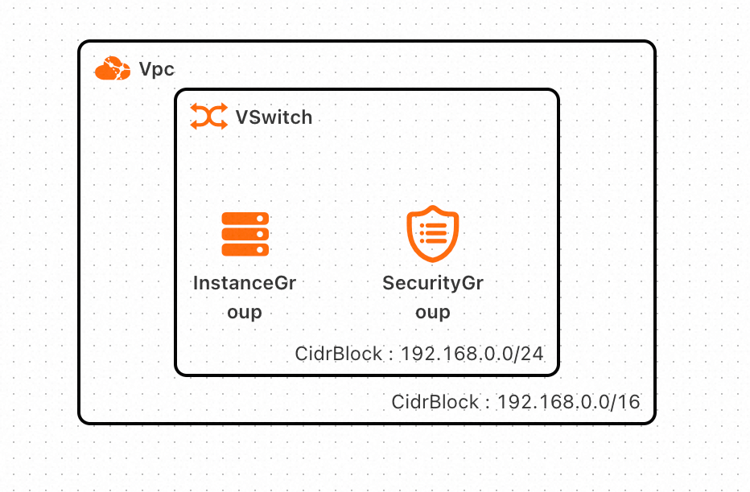
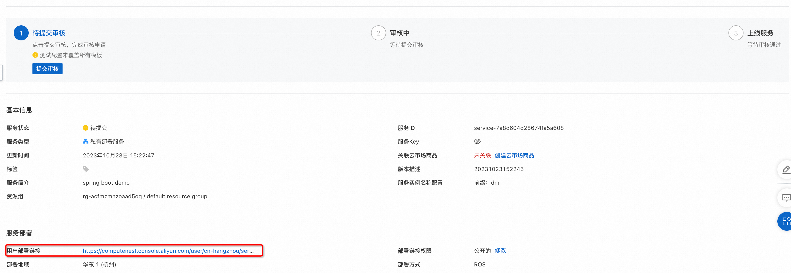
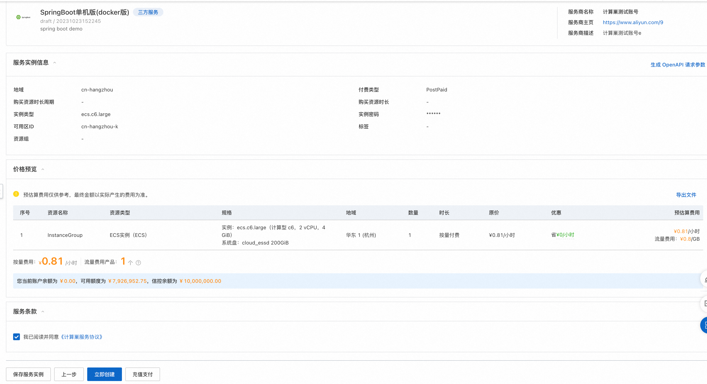
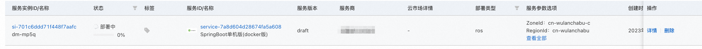
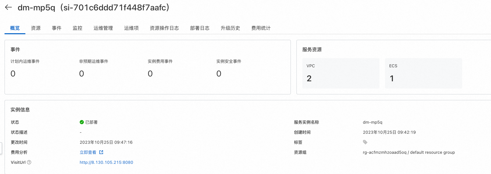
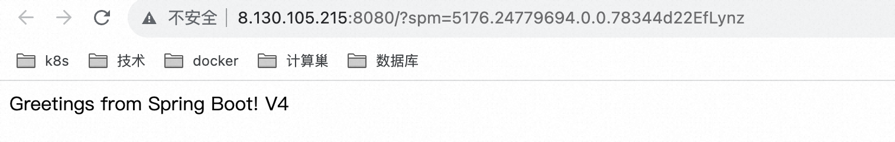

# 服务模版说明文档

## 服务说明

本文介绍基于docker部署的springboot单机ecs服务快速上手流程，本示例对应的[git地址](https://github.com/aliyun-computenest/springboot-ecs-docker-demo)

本示例会自动的构建计算巢服务，具体的服务构建流程为
1. 上传docker镜像并构建计算巢容器镜像部署物
2. 创建计算巢服务并关联容器镜像部署物

创建过程大约持续1分钟，当服务变成待提交后构建成功

## 服务架构

本部署架构为单机ecs部署，通过公网ip 8080端口访问


## 服务构建计费说明

测试本服务构建无需任何费用，创建服务实例涉及的费用参考服务实例计费说明

## RAM账号所需权限

本服务需要对ECS、VPC等资源进行访问和创建操作，若您使用RAM用户创建服务实例，需要在创建服务实例前，对使用的RAM用户的账号添加相应资源的权限。添加RAM权限的详细操作，请参见[为RAM用户授权](https://help.aliyun.com/document_detail/121945.html)。所需权限如下表所示。

| 权限策略名称                          | 备注                     |
|---------------------------------|------------------------|
| AliyunECSFullAccess             | 管理云服务器服务（ECS）的权限       |
| AliyunVPCFullAccess             | 管理专有网络（VPC）的权限         |
| AliyunROSFullAccess             | 管理资源编排服务（ROS）的权限       |
| AliyunComputeNestUserFullAccess | 管理计算巢服务（ComputeNest）的用户侧权限 |
| AliyunComputeNestSupplierFullAccess | 管理计算巢服务（ComputeNest）的服务商侧权限 |

## 服务实例计费说明

测试本服务在计算巢上的费用主要涉及：

- 所选vCPU与内存规格
- 系统盘类型及容量
- 公网带宽

计费方式包括：

- 按量付费（小时）
- 包年包月

目前提供如下实例：

| 规格族 | vCPU与内存 | 系统盘 | 公网带宽 |
| --- | --- | --- | --- |
| ecs.c6.large | 内存型c6，2vCPU 4GiB | ESSD云盘 200GiB PL0 | 固定带宽1Mbps |
| ecs.c6.2large | 内存型c6，4vCPU 8GiB | ESSD云盘 200GiB PL0 | 固定带宽1Mbps |

预估费用在创建实例时可实时看到。

## 服务实例部署流程


### 部署参数说明

| 参数组         | 参数项    | 说明                                                                     |
|-------------|--------|------------------------------------------------------------------------|
| 服务实例        | 服务实例名称 | 长度不超过64个字符，必须以英文字母开头，可包含数字、英文字母、短划线（-）和下划线（_） |
|             | 地域     | 服务实例部署的地域                                                              |
|             | 付费类型   | 资源的计费类型：按量付费和包年包月                                                      |
| ECS实例配置  | 实例类型   | 可用区下可以使用的实例规格                                                          |
|              | 实例密码   | 长度8-30，必须包含三项（大写字母、小写字母、数字、 ()`~!@#$%^&*-+=&#124;{}[]:;'<>,.?/ 中的特殊符号） |
| 网络配置        | 可用区    | ECS实例所在可用区                                                             |

### 部署步骤

0. 部署链接

1. 单击部署链接，进入服务实例部署界面，根据界面提示，填写参数完成部署。

2. 参数填写完成后可以看到对应询价明细，确认参数后点击**下一步：确认订单**。

3. 确认订单完成后同意服务协议并点击**立即创建**
   进入部署阶段。

4. 等待部署完成后就可以开始使用服务，进入服务实例详情点击visitUrl。

5. 部署结果


## 服务详细说明

本文通过将[代码](https://atomgit.com/flow-example/spring-boot)构建后，将deploy.sh和application.jar打包成package.tgz,对其中的application.jar打包成docker镜像,
通过计算巢部署物上传为容器镜像部署物，在模版中使用docker命令进行服务启动。

package.tgz打包为docker镜像对应的Dockerfile如下：

```
FROM centos

# 更新yum源地址
RUN cd /etc/yum.repos.d/ && \
    sed -i 's/mirrorlist/#mirrorlist/g' /etc/yum.repos.d/CentOS-* && \
    sed -i 's|#baseurl=http://mirror.centos.org|baseurl=http://vault.centos.org|g' /etc/yum.repos.d/CentOS-* && \
    yum makecache

RUN yum update -y && \
    yum install -y java-1.8.0-openjdk java-1.8.0-openjdk-devel && \
    yum install -y git && \
    yum clean all && \
    cd /root && \
    git clone https://github.com/aliyun-computenest/springboot-ecs-docker-demo.git && \
    mkdir -p /home/admin/application && \
    cp /root/springboot-ecs-docker-demo/artifacts/package.tgz /home/admin/application && \
    cd /home/admin/application && \
    tar xvf package.tgz && \
    rm -rf /root/springboot-ecs-docker-demo && \
    rm package.tgz
WORKDIR /home/admin/application/target
ENV JAVA_HOME /usr/lib/jvm/java-1.8.0-openjdk/
RUN export JAVA_HOME
EXPOSE 8080
CMD ["java", "-jar", "application.jar"]
```

templates/template.yaml主要由三部分组成

1. Parameters定义需要用户填写的参数，包括付费类型，实例规格和实例密码可用区参数
```
Parameters:
  PayType:
    Type: String
    Label:
      en: ECS Instance Charge Type
      zh-cn: 付费类型
    Default: PostPaid
    AllowedValues:
      - PostPaid
      - PrePaid
    AssociationProperty: ChargeType
    AssociationPropertyMetadata:
      LocaleKey: InstanceChargeType
  PayPeriodUnit:
    Type: String
    Label:
      en: Pay Period Unit
      zh-cn: 购买资源时长周期
    Default: Month
    AllowedValues:
      - Month
      - Year
    AssociationProperty: PayPeriodUnit
    AssociationPropertyMetadata:
      Visible:
        Condition:
          Fn::Not:
            Fn::Equals:
              - ${PayType}
              - PostPaid
  PayPeriod:
    Type: Number
    Label:
      en: Period
      zh-cn: 购买资源时长
    Default: 1
    AllowedValues:
      - 1
      - 2
      - 3
      - 4
      - 5
      - 6
      - 7
      - 8
      - 9
    AssociationProperty: PayPeriod
    AssociationPropertyMetadata:
      Visible:
        Condition:
          Fn::Not:
            Fn::Equals:
              - ${PayType}
              - PostPaid
  EcsInstanceType:
    Type: String
    Label:
      en: Instance Type
      zh-cn: 实例类型
    AssociationProperty: ALIYUN::ECS::Instance::InstanceType
    AssociationPropertyMetadata:
      InstanceChargeType: ${PayType}
    AllowedValues:
      - ecs.c6.large
      - ecs.c6.2xlarge
  InstancePassword:
    NoEcho: true
    Type: String
    Description:
      en: Server login password, Length 8-30, must contain three(Capital letters, lowercase letters, numbers, ()`~!@#$%^&*_-+=|{}[]:;'<>,.?/ Special symbol in)
      zh-cn: 服务器登录密码,长度8-30，必须包含三项（大写字母、小写字母、数字、 ()`~!@#$%^&*_-+=|{}[]:;'<>,.?/ 中的特殊符号）
    AllowedPattern: ^[a-zA-Z0-9-\(\)\`\~\!\@\#\$\%\^\&\*\_\-\+\=\|\{\}\[\]\:\;\<\>\,\.\?\/]*$
    Label:
      en: Instance Password
      zh-cn: 实例密码
    ConstraintDescription:
      en: Length 8-30, must contain three(Capital letters, lowercase letters, numbers, ()`~!@#$%^&*_-+=|{}[]:;'<>,.?/ Special symbol in)
      zh-cn: 长度8-30，必须包含三项（大写字母、小写字母、数字、 ()`~!@#$%^&*_-+=|{}[]:;'<>,.?/ 中的特殊符号）
    MinLength: 8
    MaxLength: 30
    AssociationProperty: ALIYUN::ECS::Instance::Password
  ZoneId:
    Type: String
    Label:
      en: Zone ID
      zh-cn: 可用区ID
    AssociationProperty: ALIYUN::ECS::Instance::ZoneId
```

2. Resources定义需要开的资源，包括新开的vpc, vswitch和ecs实例, 以及执行命令的定义,其中{{ computenest::acr::dockerconfigjson }}是下载docker所需secret的占位符，计算巢服务会在部署时替换为对应的下载秘钥。{{ computenest::acrimage::demo }}是容器镜像仓库的占位符，计算巢服务会替换成对应的镜像仓库地址。
```
Resources:
  Vpc:
    Type: ALIYUN::ECS::VPC
    Properties:
      CidrBlock: 192.168.0.0/16
  SecurityGroup:
    Type: ALIYUN::ECS::SecurityGroup
    Properties:
      SecurityGroupName:
        Ref: ALIYUN::StackName
      VpcId:
        Ref: Vpc
      SecurityGroupIngress:
        - PortRange: 8080/8080
          Priority: 1
          SourceCidrIp: 0.0.0.0/0
          IpProtocol: tcp
          NicType: internet
  VSwitch:
    Type: ALIYUN::ECS::VSwitch
    Properties:
      ZoneId:
        Ref: ZoneId
      VpcId:
        Ref: Vpc
      CidrBlock: 192.168.0.0/24
  InstanceGroup:
    Type: ALIYUN::ECS::InstanceGroup
    Properties:
      InstanceChargeType:
        Ref: PayType
      PeriodUnit:
        Ref: PayPeriodUnit
      Period:
        Ref: PayPeriod
      VpcId:
        Ref: Vpc
      VSwitchId:
        Ref: VSwitch
      SecurityGroupId:
        Ref: SecurityGroup
      ZoneId:
        Ref: ZoneId
      ImageId: centos_7_8_x64_20G_alibase_20211130.vhd
      Password:
        Ref: InstancePassword
      InstanceType:
        Ref: EcsInstanceType
      SystemDiskCategory: cloud_essd
      SystemDiskSize: 200
      InternetMaxBandwidthOut: 1
      IoOptimized: optimized
      MaxAmount: 1
  InstallPackage:
    Type: ALIYUN::ECS::RunCommand
    Properties:
      InstanceIds:
        Fn::GetAtt:
          - InstanceGroup
          - InstanceIds
      Type: RunShellScript
      Sync: true
      Timeout: 3600
      CommandContent: |-
        #!/bin/bash
        yum update -y
        yum install docker -y
        systemctl restart docker
        yum install jq -y
        
        # dockerjsonConfig解析
        dockerJson='{{ computenest::acr::dockerconfigjson }}'
        decodeDockerJson=$(echo $dockerJson | base64 -d)
        host=$(echo $decodeDockerJson | jq '.auths' | jq 'keys' | jq .[0])
        username=$(echo $decodeDockerJson | jq ".auths.$host.username" | tr -d '"')
        password=$(echo $decodeDockerJson | jq ".auths.$host.password" | tr -d '"')
        host=$(echo $host | tr -d '"')
        docker login $host --username=$username --password=$password
        docker pull {{ computenest::acrimage::demo }}
        docker run -d -p 8080:8080 {{ computenest::acrimage::demo }}
```

3. Outputs定义需要最终在计算巢概览页中对用户展示的输出
```
Outputs:
  VisitUrl:
    Description:
      en: VisitUrl.
      zh-cn: 访问页面。
    Value:
      Fn::Sub:
        - http://${Address}:8080
        - Address:
            Fn::Select:
              - 0
              - Fn::GetAtt:
                  - InstanceGroup
                  - PublicIps
```

## 其他

[实例代码源地址](https://atomgit.com/flow-example/spring-boot)

[软件包package.tgz构建流程参考](https://help.aliyun.com/document_detail/153848.html)